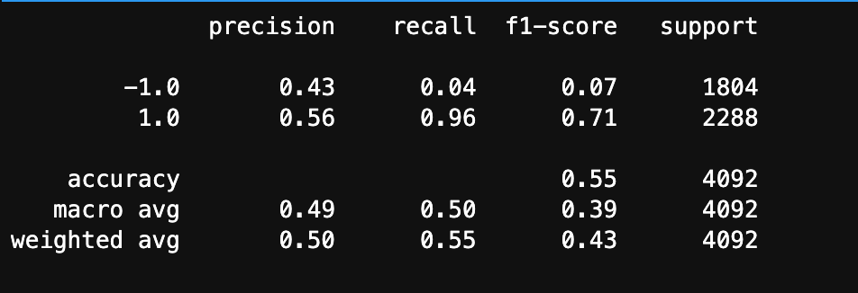
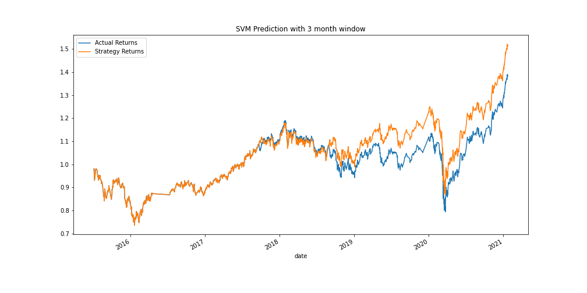
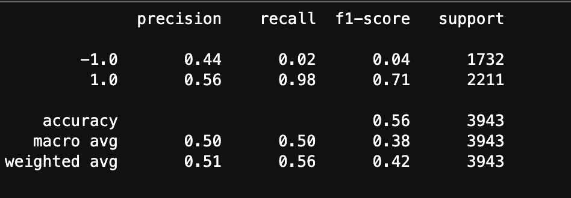
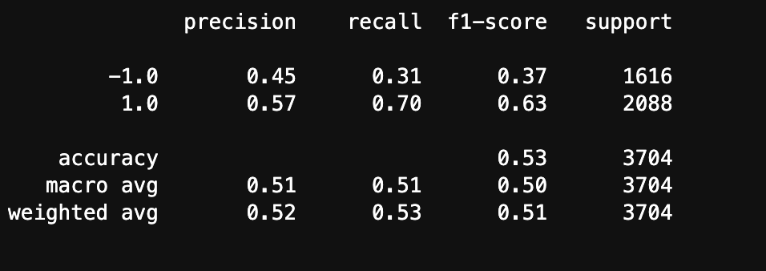
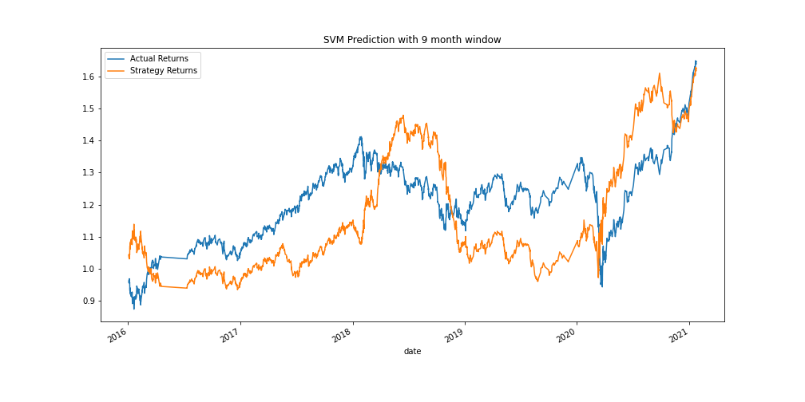
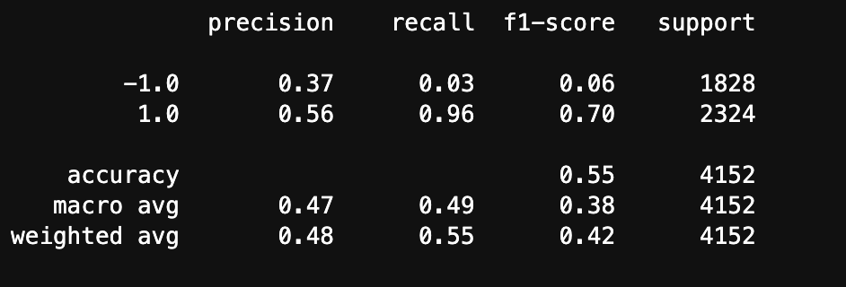
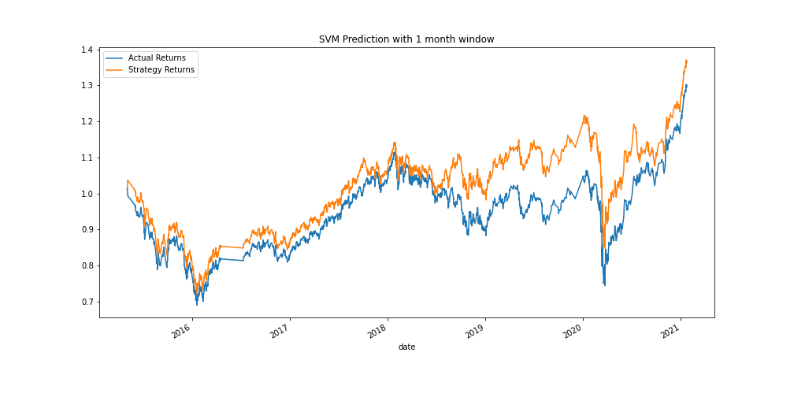
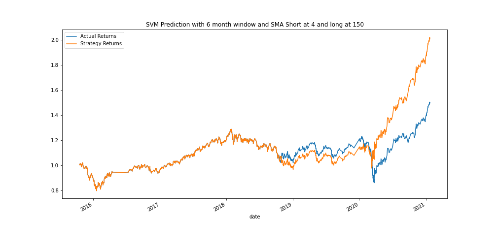
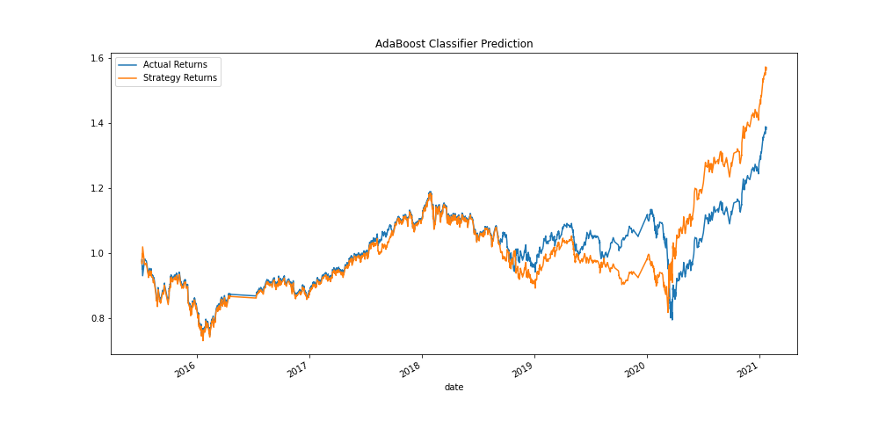
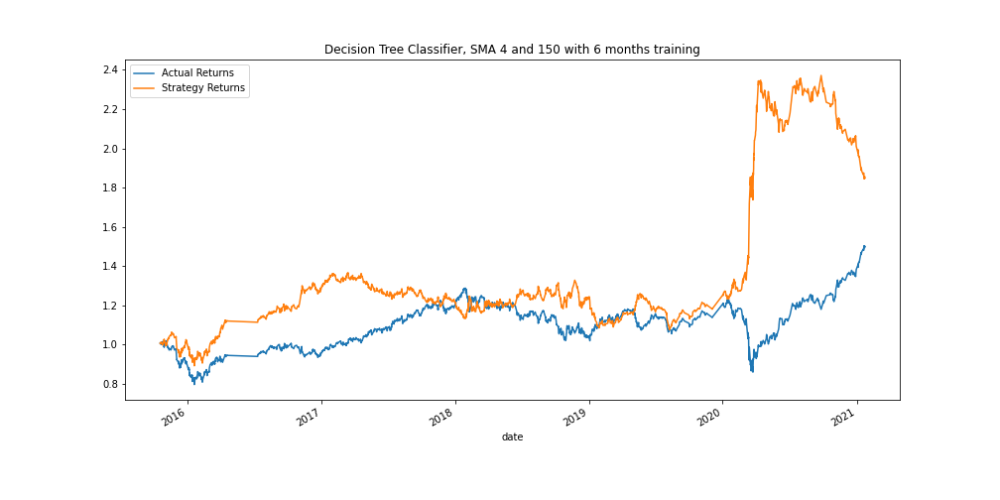

<!-- header is made with: https://github.com/kyechan99/capsule-render -->

                                                             
[Stephane Masyn](https://www.linkedin.com/in/stephane-masyn-35b16817a/) 
                                 

---

### Table of Contents

* [Overview](#overview)
* [Requirements](#requirements)
* [Data](#data)
* [Visualization](#visualization)
* [Evaluation Report](#evaluation-report)
* [License](#license)

---

## Overview [Table of Contents](#table-of-contents)

The program was designed to improve the existing algorithmic trading systems and maintain the firm’s competitive advantage in the market. In order to enhance the existing trading signals with machine learning algorithms that can adapt to new data, the following was accomplished...

* Establish a Baseline Performance

* Tune the Baseline Trading Algorithm

* Evaluate a New Machine Learning Classifier

* Create an Evaluation Report

---

## Requirements

This project leverages python 3.7 and scikit-learn.

A [conda](https://docs.conda.io/en/latest/) environment with liabraries listed below and [Jupyter Notebook/Lab](https://jupyter.org/) are required to run the code.

The following library was used:

1. [Scikit Learn](https://scikit-learn.org/stable/index.html) - Scikit Learn or Sklearn is one of the most used Python libraries for Data Science, along with others like Numpy, Pandas, Tensorflow, or Keras.

Install the following librarie(s) in your terminal...

    pip install -U scikit-learn

---

## Data

The data used in this neural network model was from derived from a CSV file called emerging_markets_ohlcv.csv:

---

## Visualization

Cumulative return plot that shows the actual returns vs. the strategy returns. 

Orignial window was 3 months.

Increase trading window to 6 months

 
Increase trading window to 9 months

Decrease trading window to 1 months

---

## Evaluation Report

### Alternative ML Model and Evaluate Strategy Returns

#### Step 1: Tune the training algorithm by adjusting the size of the training dataset:

#### Answer the following question: What impact resulted from increasing or decreasing the training window?

By increasing the training window, we have a better accuracy for the 6 months period as well as bigger returns at the end of the trading period.

We can also see that the spread between the actual returns and the strategy returns is wilder or more volatile. Meaning that at some point in the timeframe the strategy returns are much worst and at other much better. This suggest that increasing the window period increase the risk. 

But it seems that that risk can be mitigated by going with a much longer period for training the model as the 18 months period shows. 

Also, by decreasing the window to 1 month, we get a more stable strategy that keep the same accuracy. This window also shows less risk as the strategy projection always stays above the actual returns and there is much less negative volatility and less risk.

#### Step 2: Tune the trading algorithm by adjusting the SMA input features.

#### Answer the following question: What impact resulted from increasing or decreasing either or both of the SMA windows?

After testing different SMA windows, the better returns is using a short window of 4 and long window of 150. But the training period has to be changed to 6 months for better results. Without adapting the training period, the model does not perform better than the original.

This is the resulting plot

---

### Backtesting a new model to evaluate its performance:

When staying with the initial 3 months period for training the model, using the AdaBooster Classifier gives the better end results compare to the other classifiers.

#### Did this new model perform better or worse than the provided baseline model?

THe model using AdaBoost perform better if look at the final day of traiding. It return a slightly higher profit than the original model with the 3 months training period. 
 

#### Did this new model perform better or worse than your tuned trading algorithm? 

This model using AdaBooster did not take the SMA window change well at all and is now returning worst than the actual returns.

But, the model that performed the best with the window changed to 6 month and the short window SMA at 4 and long window SMA at 150 is now the Decision Tree Classifier. This model gives much better final results then all of them. 

 
 
---

## License

MIT

Copyright (c) 2021 Stephane Masyn

Permission is hereby granted, free of charge, to any person obtaining a copy
of this software and associated documentation files (the "Software"), to deal
in the Software without restriction, including without limitation the rights
to use, copy, modify, merge, publish, distribute, sublicense, and/or sell
copies of the Software, and to permit persons to whom the Software is
furnished to do so, subject to the following conditions:

The above copyright notice and this permission notice shall be included in all
copies or substantial portions of the Software.

THE SOFTWARE IS PROVIDED "AS IS", WITHOUT WARRANTY OF ANY KIND, EXPRESS OR
IMPLIED, INCLUDING BUT NOT LIMITED TO THE WARRANTIES OF MERCHANTABILITY,
FITNESS FOR A PARTICULAR PURPOSE AND NONINFRINGEMENT. IN NO EVENT SHALL THE
AUTHORS OR COPYRIGHT HOLDERS BE LIABLE FOR ANY CLAIM, DAMAGES OR OTHER
LIABILITY, WHETHER IN AN ACTION OF CONTRACT, TORT OR OTHERWISE, ARISING FROM,
OUT OF OR IN CONNECTION WITH THE SOFTWARE OR THE USE OR OTHER DEALINGS IN THE
SOFTWARE.
